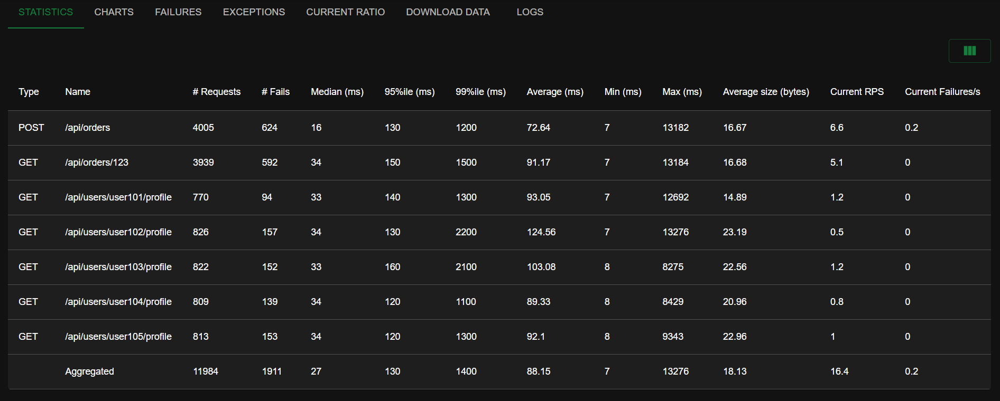
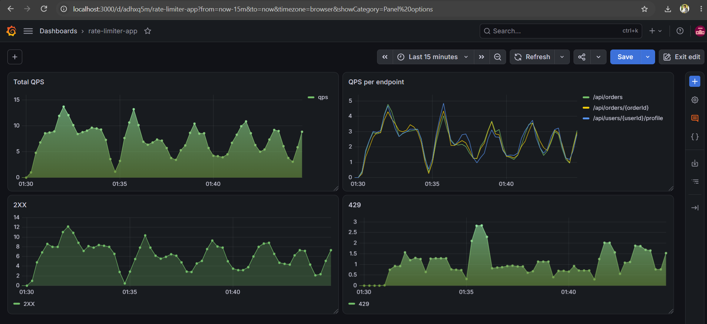

# 🚀 Spring Boot Rate Limiter on Kubernetes (Minikube)

A high-performance Spring Boot Rate Limiter application deployed using Helm on Minikube, monitored by standalone Docker containers running Prometheus and Grafana, and load-tested using Locust.

---

## 📋 Prerequisites

Ensure the following tools and runtime versions are installed on your system:

* **Java Development Kit (JDK):** Java 17 or 21
* **Build Tool:** Maven 3.8+ / Gradle 8+
* **Container Runtime:** Docker Desktop / Docker Engine 24.0+
* **Local Kubernetes:** Minikube v1.30+
* **Package Manager & CLI:** `kubectl`, `helm` 3.x
* **Load Testing:** Python 3.10+ (with virtual environment support)

---

## 🛠️ Step-by-Step Setup & Execution

# Create dedicated Docker network for monitoring
docker network create monitoring

# Run Redis container on host
docker run -d --name redis-server -p 6379:6379 redis

# Run Grafana container
docker run -d --name grafana --network monitoring -p 3000:3000 grafana/grafana

create prometheus.yml to scrape config 

# Run Prometheus container with custom config mount
docker run -d --name prometheus -p 9090:9090 --network monitoring -v ${PWD}/prometheus.yml:/etc/prometheus/prometheus.yml prom/prometheus

minikube start 

docker build -t rate-limiter-app:1.0.4 .

minikube image load rate-limiter-app:1.0.4

kubectl create namespace rate-limiter

helm install rate-limiter-app . -n rate-limiter

# pf the the traffic
minikube service rate-limiter-app -n rate-limiter --url

# prom to scrape the metrics
kubectl port-forward -n rate-limiter svc/rate-limiter-app 8080:8080

locust -f .\locustfile.py  

#config for load testing
host = 5  , ramp up = 5 , host = minikube svc url

---

## 📈 Observability & Test Visuals

### Locust Load Testing

### Grafana Monitoring Metrics

